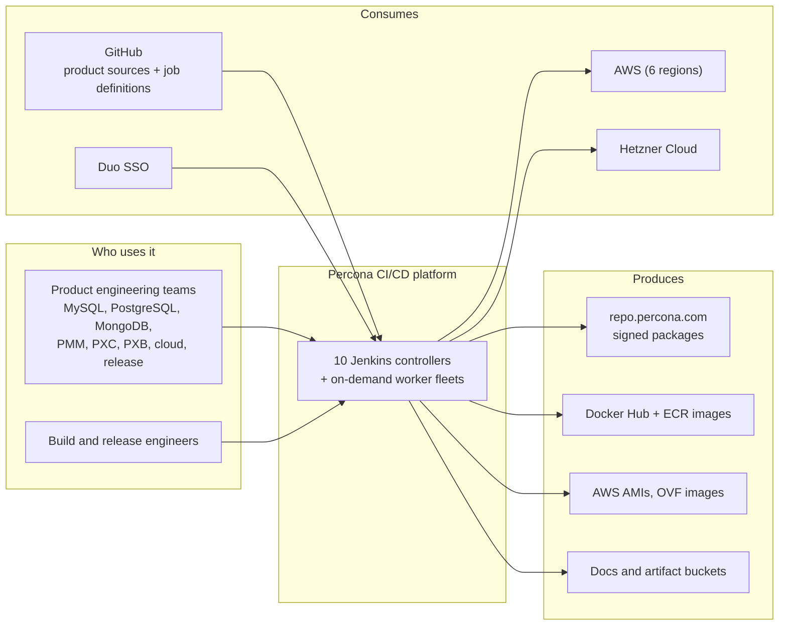
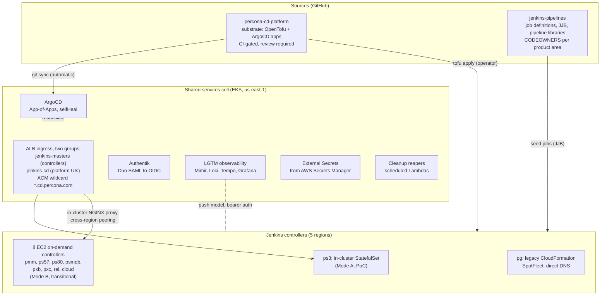
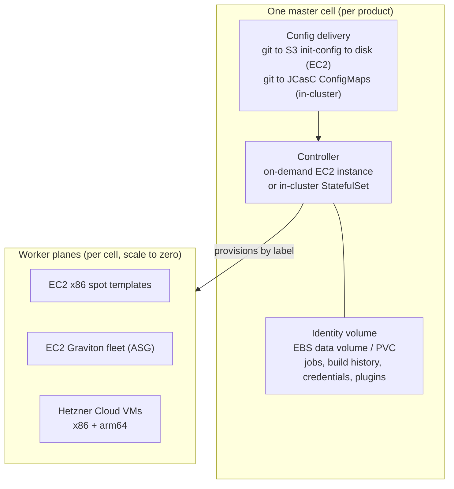
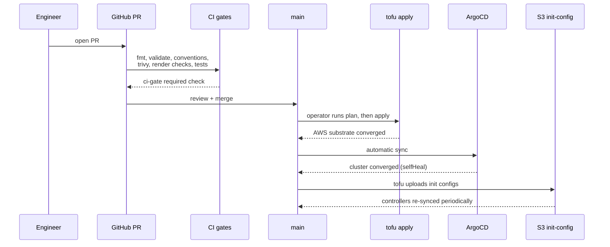
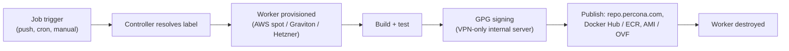

# Architecture

This document explains the structure of the Percona CI/CD platform and the
reasoning behind it: what the parts are, how they relate, what fails together,
and which trade-offs were accepted. It deliberately stays at architecture
altitude. Implementation detail lives in the [detailed docs](#detailed-docs),
operational procedures in the [runbooks](#runbooks), and decision history in
the [ADRs](adr/). Each diagram shows one zoom level and omits everything that
belongs to a deeper one.

**The platform in one paragraph.** Ten product-isolated Jenkins controllers
across five AWS regions, drawing build capacity on demand from AWS spot,
Graviton fleets, and Hetzner Cloud, are fronted, authenticated, and observed
by a single EKS shared-services cell in us-east-1. Everything is declared in
two repositories and converged automatically: OpenTofu owns the AWS
substrate, ArgoCD owns the cluster. The fleet is mid-iteration, from
CloudFormation pets, through today's Terraform-managed EC2 controllers,
toward controllers running as pods, with strictly fewer moving parts at
each step.

## System context

The platform builds, tests, signs, and distributes database software for every
supported Linux distribution and architecture. Product teams consume it
through Jenkins jobs they define themselves; the platform team owns the
substrate underneath.

The core structural decision is **one controller per product**. A
configuration error, plugin incident, or upgrade on one controller cannot
stop another product's releases; each team gets its own plugin set and
upgrade cadence; capacity scales per product. The price is fleet-wide
operations touching up to ten controllers, which this repo absorbs through
shared modules and fleet tooling.

**Architectural invariant:** a single controller failure stops exactly one
product's CI. Nothing in the platform may introduce a dependency that
violates this for build execution (see
[failure domains](#quality-attributes-and-failure-domains)).

**Direction of travel.** The current shape is a deliberate intermediate
step, not the destination. The trajectory runs: CloudFormation spot pets
(one master left) -> Terraform-managed on-demand EC2 controllers behind
shared ingress (today's eight) -> **controllers running as pods in the
cluster** (the end goal, being proven by ps3). Each migration step is an
iteration that keeps the identity volume and deletes hand-tended
infrastructure around it; the EC2-specific plumbing documented below exists
to serve the middle step and is designed to be removed as controllers move
in-cluster ([ADR 0024](adr/0024-jenkins-fleet-ownership-boundary.md)).
The end state has strictly fewer moving parts per controller: no NGINX hop,
no endpoint reconciler, no cross-region peering, no per-master VPC,
user-data, or SSM config sync; plugins arrive baked into a locked,
automatically bumped image instead of being hand-fed to a JVM;
configuration is JCasC rendered from git; and the identity volume becomes
a snapshotted PVC with a rehearsed restore.

## Platform overview

Two repositories produce the platform; one shared-services cell fronts and
observes it; ten controllers do the work.

**Fronting modes at a glance.** Every controller is reached one of three
ways; the table is the map, details follow.

| Mode | Hosts | Path | Status |
|---|---|---|---|
| A: in-cluster | `ps3` | ALB to pod, directly | Target shape for every controller; proof of concept |
| B: proxied EC2 | `pmm`, `ps57`, `ps80`, `psmdb`, `pxb`, `pxc`, `rel`, `cloud` | ALB to in-cluster NGINX, then VPC peering to the EC2 controller | Today's production; transitional by design |
| Legacy direct | `pg` | DNS to the master's own EIP, on-box TLS | Pre-migration shape; last master to move |

**Shared ingress (modes A and B).** Master DNS points at the dedicated
`jenkins-masters` ALB group; platform UIs (Grafana, ArgoCD, Authentik) and
the observability push receivers ride the separate `jenkins-cd` group, so
master rule churn cannot break platform ingress. Neither ALB is
hand-managed: the **AWS Load Balancer Controller** provisions and reconciles
both from Kubernetes Ingress objects. One Ingress per host carries the host
rule; the `group.name` annotation merges Ingresses into their shared ALB,
and external-dns publishes the records. Each group name materializes as
exactly one ALB, so the cell runs two load balancers in total; an Ingress
that declared no group would get a dedicated ALB of its own, which is why
every Ingress here carries one. Host rules and group definitions are
therefore code: `resources/addons/jenkins-ingress/` (its values file is the
canonical description of the `jenkins-masters` group) and the per-addon
Ingress annotations for `jenkins-cd`; onboarding a host is
[`runbooks/add-jenkins-host.md`](runbooks/add-jenkins-host.md).

**Mode A: in-cluster.** The ALB routes straight to the controller pod. This
is the target shape for every controller; today it is a proof of concept
carried by ps3 alone, and no further master moves in-cluster until it has
proven itself.

**Mode B: proxied EC2.** A shared in-cluster NGINX proxies over cross-region
VPC peering to the controller's private IP. The hop exists because ALB
target groups with `target-type: ip` can only point at addresses inside the
cluster VPC, and the masters live in five other regions. The NGINX
Deployment is a stateless data-plane proxy (plain nginx, no Jenkins role),
distinct from the AWS Load Balancer Controller, which is control plane only.
The third piece, the `jenkins-endpoint-reconciler` CronJob, is also control
plane: it polls EC2 by tag each minute and writes the controller's current
private IP into the Service's EndpointSlice, so instance replacement
converges without DNS changes. The entire Mode B chain is transitional:
every controller that moves in-cluster deletes its share of the proxy, the
reconciliation, and the peering.

**Legacy direct.** `pg` predates the migration: DNS points at its own EIP
with on-box TLS, still CloudFormation-managed in jenkins-pipelines. Details:
[`connectivity.md`](connectivity.md), [`tls-strategy.md`](tls-strategy.md).

**Internal network.** The private topology is a hub and spoke: the EKS cell
VPC peers to each EC2 master VPC, one peering per master, across regions.
Peering is non-transitive and the spokes are never peered to each other, so
masters cannot reach one another privately, which preserves the per-product
failure domain at the network layer. The peerings carry the proxy path
(NGINX to master :8080) and platform-to-master traffic only; worker
provisioning and build traffic stay inside each master's own VPC or go out
to the clouds directly. Every VPC CIDR must therefore be unique across the
fleet, which is a standing migration precondition. Addressing and route
detail: [`connectivity.md`](connectivity.md).

**Ownership boundary.** OpenTofu owns AWS-side state up to "ArgoCD healthy";
ArgoCD owns everything in-cluster from there, reconciling from `resources/`.
TF outputs cross the boundary as annotations on the ArgoCD cluster Secret,
which ApplicationSets read as Helm values
([`argocd-bootstrap.md`](argocd-bootstrap.md)).

**Why one shared control plane.** Concentrating the cross-cutting services in
a single cell buys integration once instead of ten times:

- **Authentication:** Duo is integrated exactly once (SAML into Authentik);
  every platform UI then gets OIDC SSO with MFA from the same identity
  provider, and offboarding revokes access in one place
  ([`authentication.md`](authentication.md)). The contrast is the current
  Jenkins reality: each controller still carries its own GitHub OAuth plugin
  and client credentials, configured manually per instance; moving the
  controllers onto Authentik OIDC replaces ten hand-managed integrations
  with one.
- **TLS:** one auto-renewing ACM wildcard replaces per-master certbot
  renewal, which was a recurring outage class.
- **Patching:** internet-facing components (ArgoCD, Authentik, Grafana,
  External Secrets) are upgraded centrally through single PRs instead of
  per-master operations.
- **Observability and secrets:** one ingestion path for fleet telemetry, one
  distribution path from Secrets Manager into workloads.
- **Drift control:** one reconciler (ArgoCD) converges the entire in-cluster
  estate to git.

The accepted cost is a shared failure domain for web access, bounded by the
invariant that build execution does not depend on the cell (see
[failure domains](#quality-attributes-and-failure-domains)).

## The master cell

Every controller is an instance of the same repeating unit
(`terraform/modules/jenkins-master`, instantiated once per
`terraform/master-<host>.tf`). Compute is disposable; identity is the
volume. The EC2 instantiation of the cell is the intermediate form; the pod
instantiation (ps3 today) is the target form of the same unit.

**The volume is the master.** Each controller's `JENKINS_HOME` lives on a
persistent volume that survives instance replacement; the instance attaches
it at boot and is otherwise interchangeable. Volumes are deletion-protected
and reaper-exempt; the module owns the details. In-cluster, the same role is
played by a Retain-class PVC with daily snapshots and a validated restore
drill ([ADR 0028](adr/0028-jenkins-dynamic-config-data-lifecycle.md)).
Migrations must reproduce the live IAM shape of master and worker roles, not
the template shape; out-of-band grants are carried via module toggles.

**Labels are the scheduling abstraction.** Pipelines request capacity by
label (`docker-32gb-aarch64`, `min-ol-9-x64`); which cloud serves a label is
a controller-side decision. Pipeline authors never reference a provider, so
capacity can move between AWS spot, Graviton fleets, and Hetzner without
touching job definitions. Workers are created per build and destroyed after,
holding fleets at zero when idle.

## Runtime flows

The two flows that explain the system: how change reaches production, and
how a build becomes a published artifact.

Observability rides a push model: every controller ships metrics, logs, and
traces through a bearer-authenticated gateway into Mimir, Loki, and Tempo,
dashboarded in Grafana. Full path and conventions:
[`observability.md`](observability.md),
[`jenkins-fleet-scrape.md`](jenkins-fleet-scrape.md).

## Quality attributes and failure domains

| Attribute | Mechanism | Boundary |
|---|---|---|
| Availability | Per-product controllers; on-demand instances ended master-side spot reclaims; identity volumes survive instance loss; worker interruptions absorbed by pipeline retries and fleet resubmit guards | A controller failure stops one product. Loss of the us-east-1 cell degrades web UI, SSO, and webhooks fleet-wide; running builds and worker provisioning continue, because build execution never traverses the ALB |
| Security | ACM TLS at the ingress; Duo SAML to Authentik to OIDC for the platform UIs (Jenkins controllers use a GitHub OAuth realm today; Authentik is the target); secrets in AWS Secrets Manager via External Secrets; IMDSv2 everywhere; package signing confined to a VPN-only internal server; the public repos carry no account secrets | Shared-fate components for web access: ALBs, Authentik, ArgoCD. Break-glass access is per-master SSM, independent of the cell ([`runbooks/master-shell-access.md`](runbooks/master-shell-access.md)) |
| Cost | Controllers are small on-demand instances sized to the JVM; build capacity is spot or Hetzner, scaled to zero when idle; account reapers age out orphaned instances and volumes ([ADR 0030](adr/0030-account-cleanup-reapers-in-terraform.md)) | Worker cost scales with build demand, not fleet size |
| Evolvability | Everything-as-code with converging reconciliation; 30 ADRs record decisions; migrations run behind preflight and validation gates with documented rollforward | Change risk concentrates at merge time, so the CI gates and review are the control surface |

## Decisions and trade-offs

The standing decisions that shape the platform, each with the alternative it
displaced. Full records in [`adr/`](adr/).

- **Iterative migration**, not a big-bang re-platform. Each step (CFN spot
  to TF on-demand to pods) keeps the identity volume, deletes hand-tended
  infrastructure, and is validated by gates before the next; the cost is
  living with transitional plumbing in the middle step.
- **One controller per product**, not one shared controller. Isolation and
  per-team cadence over consolidation; fleet-wide work costs more.
- **On-demand controllers, spot workers.** Paying for controller stability
  ended release-window losses; spot economics are kept where retries make
  interruption cheap.
- **One shared ingress cell**, not ten per-master TLS stacks. One ACM
  wildcard and SSO integration replaced per-master certbot renewal, trading
  a fleet-wide UI dependency for it.
- **GitOps convergence**, not hand-tended state. Drift now converges to the
  repo; in exchange, a bad merge propagates automatically, which is why the
  merge gate carries the CI suite and review.
- **Persistent identity volumes**, not stateless controllers. Build history
  and credentials survive any rebuild; the volumes remain the platform's
  pets, with the long-term direction recorded in
  [ADR 0024](adr/0024-jenkins-fleet-ownership-boundary.md).
- **Two repositories.** The substrate repo carries strict gates; the job
  repo keeps the low-friction, CODEOWNERS-routed contribution model that
  product teams already use.

## Risks and technical debt

Most of these are properties of the intermediate step and retire as
controllers move in-cluster; they are listed because the middle step is
today's production.

- `pg` remains on CloudFormation and a SpotFleet, with on-box TLS; its
  migration must follow the live-IAM-parity preflight.
- Eight identity volumes are irreplaceable state; snapshots exist, but the
  restore drill is validated only for the in-cluster master.
- Controller-side configuration applied through the UI is invisible to git
  until codified; treat any UI change as temporary.
- The shared-services cell is single-region; a regional event degrades all
  UIs and SSO at once. The mitigation today is the SSM break-glass path,
  not a second cell.
- Disaster recovery for the cell is documented
  ([`runbooks/disaster-recovery.md`](runbooks/disaster-recovery.md)) but not
  yet rehearsed end to end.
- Plugin state is declarative only for the in-cluster controller (locked
  manifest, baked image, automated bump PRs); the EC2 controllers are still
  updated by operator action. The end state resolves this per migrated
  controller; an interim AMI-bake for the EC2 fleet is an open question.

## Open questions

Unsettled points, listed here so they are visible; each graduates to a
Proposed ADR when picked up.

- **Mode B plumbing.** The reconciler loop is eventually consistent (up to
  about a minute of proxied 503s on instance replacement; multi-match is
  handled by probing and preferring the newest serving instance). Options:
  give each master a stable ENI so the endpoint never changes and the
  reconciler retires; go event-driven (EventBridge instance-state events);
  or accept the minute because Mode A eventually deletes the whole chain.
  Investment here trades against the in-cluster timeline.
- **In-cluster pace.** What ps3 must demonstrate (restore drill done; HA
  guards, PDB and preStop drain still pending per ADR 0025) before a second
  master moves, and which master goes next.
- **Controller authentication.** When to replace the ten hand-managed GitHub
  OAuth integrations with Authentik OIDC, and in what order.
- **Cell resilience.** Whether a second-region story (or only a rehearsed
  recovery) is the right answer to the single-region shared-services cell.
- **Plugin lifecycle on EC2 controllers.** Whether to extend the in-cluster
  pattern (locked manifest, baked image, automated bump PRs) to the EC2
  masters via AMI or stay with operator-driven updates until Mode A.

## Reference

### Host scope

| Host(s) | Mode | Notes |
|---|---|---|
| `pmm`, `ps80`, `pxc`, `pxb`, `psmdb`, `ps57`, `rel`, `cloud` (`.cd.percona.com`) | B: ALB to in-cluster NGINX to EC2 controller | Single on-demand instances, Terraform-managed (`terraform/master-<host>.tf`), EIP-less (dynamic public IP; shell via SSM). pxc exceptionally keeps an EIP for a pinned inbound JNLP agent |
| `pg.cd.percona.com` | Legacy direct | Own EIP, on-box openresty + certbot, CloudFormation SpotFleet (`Percona-Lab/jenkins-pipelines/IaC/pg.cd/`). The only remaining master on this shape |
| `ps3.cd.percona.com` | A: in-cluster StatefulSet (PoC) | Served directly by the pod; seeded from the former EC2 master via cross-region EBS snapshot ([`runbooks/migrate-ps3-to-eks.md`](runbooks/migrate-ps3-to-eks.md)). The EC2 pet was retired 2026-06-07; its still-load-bearing substrate moved to `jenkins-arm-standalone` ([`runbooks/decommission-ps3-ec2-master.md`](runbooks/decommission-ps3-ec2-master.md)) |
| `grafana.cd.percona.com`, `argocd.cd.percona.com` | In-cluster services | Platform UIs behind the same ALB |

### Compute topology (EKS cell)

Four tiers, each tagged `workload.percona.com/tier` and (where exclusive)
tainted. Two MNGs + two Karpenter NodePools.

| Tier | Capacity | AZ | Hosts |
|---|---|---|---|
| `bootstrap` | MNG `system`, on-demand | multi-AZ | ArgoCD, Karpenter, LB controller, external-secrets, external-dns |
| `obs-state` | MNG `prometheus_system`, on-demand | us-east-1a | Authentik Postgres, Grafana |
| `lgtm-stateful` | Karpenter NodePool, on-demand | us-east-1a | Mimir, Loki, Tempo ingesters; store-gateway; compactor |
| `general` | Karpenter NodePool, spot + on-demand | us-east-1a | Stateless LGTM, web frontends, NGINX proxy, reconciler |

The Karpenter pools and the `prometheus_system` MNG are pinned to
us-east-1a for the same reason: their workloads carry EBS volumes that must
follow the pod, and multi-AZ there would require EFS (not provisioned).
Only the `bootstrap` MNG is multi-AZ; everything stateful is on-demand, and
spot appears only in the `general` pool.

### Storage

| StorageClass | Default | Reclaim | Used by |
|---|---|---|---|
| `gp3` | yes | Delete | Stateless scratch volumes |
| `gp3-monitoring-1a-retain` | no | Retain | Grafana data, Authentik Postgres |
| `gp3-jenkins-1a-retain` | no | Retain | In-cluster `JENKINS_HOME` |

LGTM long-term data lives in S3 (Mimir blocks, Loki chunks, Tempo traces).

### ArgoCD applications

App-of-Apps (`argocd-bootstrap/root`) fans out to ApplicationSets reconciling
`resources/addons/` (one app per addon) and
`resources/jenkins/master/instances/` (one per in-cluster master).

- **Bootstrap:** external-secrets, aws-load-balancer-controller,
  external-dns, karpenter, storageclass-gp3, priorityclasses,
  prometheus-operator-crds, snapscheduler
- **Identity:** authentik, headlamp
- **Observability:** mimir, loki, tempo, grafana, alloy, alloy-gateway,
  prometheus-node-exporter, kube-state-metrics, mtr
- **Jenkins:** jenkins-ingress, jenkins-endpoint-reconciler, jenkins-ps3-k8s
- **Data:** cloudnative-pg

### Resilience mechanisms (EC2 controllers)

The controllers no longer run on spot, but the defenses built for that era
stay active and cover any abrupt instance loss:

- **Replacement before interruption.** Capacity rebalancing requests a
  substitute when AWS signals reclaim risk, ahead of the two-minute notice
  (relevant to pg, the one master still on a SpotFleet).
- **Graceful drain.** A boot-installed hook watches instance metadata for
  an interruption notice and runs quiet-down, wait, safe-exit, so running
  builds checkpoint instead of dying mid-step.
- **Pipelines survive a dead JVM.** Durability is forced to
  `MAX_SURVIVABILITY` at every start; after an abrupt stop, builds resume
  at the same pipeline step once the controller returns.
- **Workers outlive the controller.** After a restart, the patched Hetzner
  plugin re-adopts surviving workers instead of reaping them, and
  per-datacenter circuit-breaker state is restored from disk.

Mechanics and edge cases:
[`ec2-master-resilience.md`](ec2-master-resilience.md). Readiness audit:
`scripts/check-master-spot-readiness.sh`, run before declaring a master
able to absorb an interrupt.

### Codemap

Implementation lives here; names are searchable, deliberately not linked to
lines:

- `terraform/` — substrate: one `master-<host>.tf` per controller,
  `modules/jenkins-master` (the cell), `modules/jenkins-arm-fleet` and
  `modules/jenkins-arm-standalone` (Graviton planes),
  `modules/scheduled-lambda` (reapers), `lambdas/`
- `resources/addons/` — one directory per ArgoCD addon
- `resources/jenkins-masters/<host>/` — per-controller `init.groovy.d`
  delivered via S3
- `resources/jenkins/` — in-cluster controller chart, instances, clouds
  catalog
- `images/` — controller and tooling images (the plugin lock lives here)
- `scripts/` — verification and audit tooling
  ([`scripts/README.md`](../scripts/README.md))

### Detailed docs

- [`observability.md`](observability.md) — LGTM stack, push pipeline
- [`karpenter.md`](karpenter.md) — NodePool tuning, spot fallback
- [`pod-identity.md`](pod-identity.md) — IAM associations
- [`argocd-bootstrap.md`](argocd-bootstrap.md) — GitOps Bridge, cluster Secret
- [`authentication.md`](authentication.md) — Duo SAML, Authentik, OIDC
- [`tls-strategy.md`](tls-strategy.md) — ACM wildcard, ssl-policy
- [`connectivity.md`](connectivity.md) — request paths, peering
- [`eks-hardening.md`](eks-hardening.md) — access entries, IMDSv2, KMS
- [`ec2-master-resilience.md`](ec2-master-resilience.md) — interruption handling
- [`jenkins-fleet-scrape.md`](jenkins-fleet-scrape.md) — fleet metrics path

### Runbooks

- [`runbooks/master-shell-access.md`](runbooks/master-shell-access.md) — shell on any controller
- [`runbooks/add-jenkins-host.md`](runbooks/add-jenkins-host.md) — new host onto the shared ALB
- [`runbooks/jenkins-ssl-cutover.md`](runbooks/jenkins-ssl-cutover.md) — per-master SSL cutover
- [`runbooks/migrate-ps3-to-eks.md`](runbooks/migrate-ps3-to-eks.md) — in-cluster migration
- [`runbooks/decommission-ps3-ec2-master.md`](runbooks/decommission-ps3-ec2-master.md) — EC2 pet retirement
- [`runbooks/disaster-recovery.md`](runbooks/disaster-recovery.md) — cell recovery
- [`runbooks/cleanup-reapers.md`](runbooks/cleanup-reapers.md) — account hygiene
- [`runbooks/eks-upgrade.md`](runbooks/eks-upgrade.md) — cluster version bumps
- [`runbooks/bootstrap-state.md`](runbooks/bootstrap-state.md) — state backend recreation
- [`runbooks/mng-label-taint-changes.md`](runbooks/mng-label-taint-changes.md) — MNG edits without drains
- [`runbooks/restore-mimir.md`](runbooks/restore-mimir.md) — metrics restore
- [`runbooks/grafana-saml-cutover.md`](runbooks/grafana-saml-cutover.md), [`runbooks/authentik-bootstrap.md`](runbooks/authentik-bootstrap.md) — identity setup

### ADRs

Decision history lives in [`adr/`](adr/), one page per architecturally
significant decision; superseded records are kept and marked.
