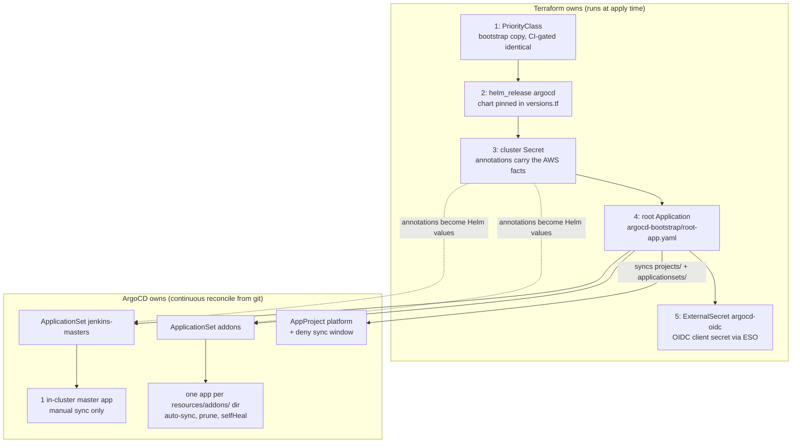
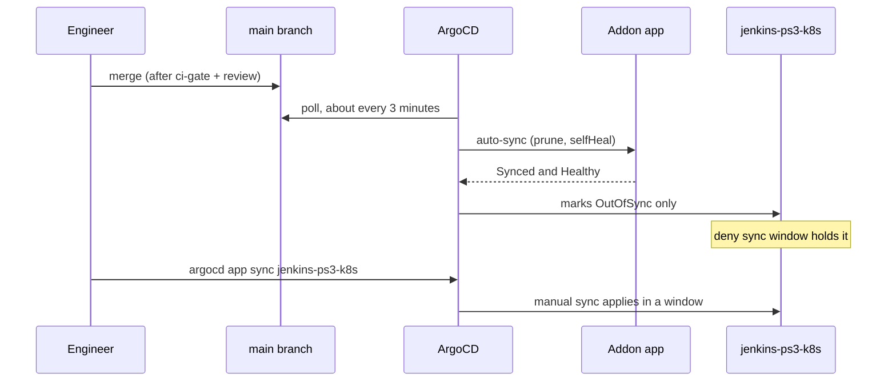

# ArgoCD bootstrap

How GitOps starts on this platform. Terraform installs ArgoCD (and the
priority class its pods need), records the AWS-side values the charts in
git will need, applies one root Application, and feeds ArgoCD its OIDC
client secret. Everything after that point reconciles from git.

The middle step exists because of a simple gap: the Helm charts need real
AWS identifiers (IAM role ARNs with generated suffixes, the ACM
certificate ARN, S3 bucket and SQS queue names, the account ID), and none
of them can live in git. They only exist after Terraform creates them,
they change if the infrastructure is recreated, and some of them must stay
out of a public repository. So Terraform writes them onto a Kubernetes
Secret in the cluster, and ArgoCD templates them into chart values from
there. That handoff is the whole trick. This is the
[GitOps Bridge](https://github.com/gitops-bridge-dev/gitops-bridge) pattern,
hand-rolled rather than consumed as a module (the upstream repos have been
dormant since mid-2024, and the pattern is about fifty lines of Terraform).
Decision record: [ADR 0005](adr/0005-gitops-bridge-bootstrap.md).

## The five-step chain

Terraform owns exactly five cluster-facing resources, in strict order
(`terraform/argocd.tf`):

1. **`kubectl_manifest.argocd_priorityclass`**: a bootstrap copy of the
   `platform-system-critical` PriorityClass that ArgoCD's own pods
   reference. The GitOps addon that owns the class steady-state only syncs
   after ArgoCD runs, so on an empty cluster nothing else would create it
   and no ArgoCD pod could schedule. Server-side apply lets Terraform and
   the addon co-own the object; `just bootstrap-priorityclass-check` fails
   CI if the two definitions ever diverge.
2. **`helm_release.argocd`**: the `argo-cd` chart, version pinned in
   `terraform/versions.tf`. It depends on the coredns, kube-proxy, and
   pod-identity-agent EKS addons, so DNS, Service routing, and the
   credential agent exist before ArgoCD schedules.
3. **The cluster Secret**: carries the Terraform-to-GitOps contract (next
   section). Depends on the release.
4. **`kubectl_manifest.argocd_root_app`**: applies
   `argocd-bootstrap/root-app.yaml` verbatim. Depends on the Secret.
5. **`kubectl_manifest.argocd_oidc_external_secret`**: the ExternalSecret
   that materializes ArgoCD's OIDC client secret from AWS Secrets Manager
   (see SSO under Install shape). Terraform-owned so the Secret exists
   before helm rolls server pods on later applies. Depends on the root
   app: on a fresh cluster the root app must land first so GitOps installs
   ESO at all before this resource needs its CRD.

The chain, and the ownership boundary it creates:

The diagram shows ownership, not network paths. After step 5, Terraform
stops touching the cluster. ArgoCD is
Terraform-installed rather than self-managed because of the bring-up
chicken-and-egg: its OIDC config and Ingress live in chart values that must
exist before any addon can sync. Self-managing ArgoCD later is a known
pattern with known caveats
([declarative setup](https://argo-cd.readthedocs.io/en/stable/operator-manual/declarative-setup/)).

### Fresh-cluster (DR) bootstrap is two-phase

Step 5 has a dependency Terraform cannot order: the ExternalSecret CRD is
itself GitOps-installed (`resources/addons/external-secrets/`), minutes
after ArgoCD first syncs. On an empty cluster the first apply therefore
fails on exactly that resource, by design. `just bootstrap-dr` encodes the
full sequence: apply (aborting unless the failure is exactly the
ExternalSecret), wait for the CRD to exist and become Established, re-plan
and re-apply (fail-closed), wait for ESO to materialize the OIDC secret,
then restart argocd-server so it picks the secret up. On a non-empty
cluster the recipe exits after a clean single apply.

## Install shape

- HA where it counts: application controller single replica (leader
  election), server, repo-server, and ApplicationSet controller at 2
  replicas with PDBs, redis-ha on.
- `server.insecure=true`: TLS terminates at the ALB, argocd-server speaks
  plain HTTP behind it. The chart's self-signed certificate would fail the
  ALB health check.
- One hostname (`argo.cd.percona.com`) on the `jenkins-cd` ALB group
  serves both UI and CLI: the chart generates a second gRPC service and
  the Ingress condition-routes `Content-Type: application/grpc` to it
  (gRPC target group health expects success code 0, HTTP expects 200).
- Placement on the `bootstrap` tier with the critical priority class, so
  Karpenter consolidation never evicts the GitOps engine.
- SSO: Dex is disabled. Authentik is the OIDC provider (client created by
  the Authentik blueprint in `resources/addons/authentik/`), with the
  client secret delivered by an ExternalSecret that Terraform itself
  applies, so it exists before the server pods roll. That ExternalSecret
  must carry the label `app.kubernetes.io/part-of: argocd`, without it the
  server silently fails to resolve `$argocd-oidc:client_secret`.
- RBAC: deny by default (`policy.default: ""`), groups-only scopes, two
  grants today (`grafana_cd_admins` to admin, `percona` to readonly). The
  local admin account is disabled. Break-glass:
  [`runbooks/argocd-admin-recovery.md`](runbooks/argocd-admin-recovery.md).

## The bridge: cluster Secret annotations

The Secret (`argocd.argoproj.io/secret-type: cluster`, label
`enabled: "true"`) is how Terraform facts reach Helm values. ApplicationSet
[cluster generators](https://argo-cd.readthedocs.io/en/stable/operator-manual/applicationset/Generators-Cluster/)
select it by label and expose every annotation as a template parameter.
The annotation contract today is 29 keys, grouped:

- Identity: cluster name, account ID, region, VPC ID.
- Ingress and DNS: Route53 zone, ACM wildcard ARN, the ArgoCD, Grafana,
  and Authentik hostnames.
- IAM role ARNs for the Pod Identity consumers
  ([`pod-identity.md`](pod-identity.md)) and Karpenter (role, node role,
  interruption queue).
- LGTM: three bucket names, three role ARNs, the KMS key, three push
  endpoints.
- Storage: the EFS filesystem ID consumed by the efs-sc StorageClass.
- Authentik SAML: enabled flag and the IdP metadata, base64-encoded so
  multi-line XML survives the annotation-to-values pipeline.

Adding a bridged value is two edits: the annotation in
`terraform/argocd.tf` and the consuming read in the ApplicationSet. The
trade-off of this pattern (cluster state lives in a Secret rather than
git) is a known critique with a known alternative (Terraform writing
values files into git), acknowledged and not adopted.

## App generation

The root Application syncs only
`argocd-bootstrap/{projects,applicationsets}/**.yaml`, recursively, with
automated prune and selfHeal. It deliberately runs in the built-in
`default` project (only that project can create the `platform` AppProject
without a circular dependency), and `root-app.yaml` itself is excluded
from its own sync, Terraform owns it. The
[app-of-apps pattern](https://argo-cd.readthedocs.io/en/stable/operator-manual/cluster-bootstrapping/)
implies one rule: push access to the bootstrap directory is
admin-equivalent power, which is what the repo's review gate protects.

Two ApplicationSets fan out from there, both matrix generators of the
cluster Secret times a
[git directory generator](https://argo-cd.readthedocs.io/en/stable/operator-manual/applicationset/Generators-Git/):

- **addons**: one Application per `resources/addons/<dir>`, deployed into
  a namespace named after the directory. A single broadcast `valuesObject`
  carries the bridged values to all of them, Helm ignores keys a chart
  does not consume. Wrapper-chart values must sit at top level, not under
  the subchart key, a recurring trap. Sync policy: automated, prune,
  selfHeal, `PruneLast`, `ServerSideApply` (the standard answer to
  oversized CRD annotations,
  [sync options](https://argo-cd.readthedocs.io/en/stable/user-guide/sync-options/)).
- **jenkins-masters**: one Application per
  `resources/jenkins/master/instances/<dir>`. No automated sync at all.
  The ECR registry reaches the chart as a Helm parameter, which keeps the
  account ID out of this public repo.

The `platform` AppProject restricts sources (this repo plus seven chart
repos) and pins the destination cluster, and carries the deny
[sync window](https://argo-cd.readthedocs.io/en/stable/user-guide/sync_windows/)
that gates the singleton Jenkins controller: deny all day, every day, for
the named app `jenkins-ps3-k8s`, with `manualSync: true` so an operator
sync in a window still works. Each new in-cluster master must be added to
that list by name, never as a glob (a glob would freeze the
jenkins-ingress and reconciler addons too). Rollout gating rationale:
[ADR 0025](adr/0025-singleton-controller-rollout-gating.md).

The split is easiest to see in motion. One merge, two outcomes:

## CRDs and ordering

- CRDs ride their charts. The prometheus-operator CRDs are their own addon
  whose every CRD carries `helm.sh/resource-policy: keep`, so no prune or
  uninstall can cascade into custom resources. Karpenter's CRDs ship in
  its chart under ServerSideApply.
- Ordering is eventual consistency, not choreography: addons retry until
  their CRDs exist. The deliberate exceptions: sync wave -100 on the
  priority classes (everything references them), wave 1 on the
  snapscheduler schedules (operator first), and
  `SkipDryRunOnMissingResource` on the CNPG Cluster resource.

## Operations

| Task | How |
|---|---|
| Add an addon | Drop `resources/addons/<name>/` (Chart.yaml + values.yaml). The ApplicationSet generates the app |
| Bridge a new value | Annotation in `argocd.tf` plus a read in the ApplicationSet |
| Add an in-cluster master | Instance values dir plus its name in the platform project's deny window |
| Park a master | Move its dir to `resources/jenkins/_disabled/` (toggling the generated app does not stick under a matrix generator) |
| Sync the singleton | `argocd app sync jenkins-ps3-k8s` inside a window, ADR 0025 |
| Break-glass admin | [`runbooks/argocd-admin-recovery.md`](runbooks/argocd-admin-recovery.md) |

Inventory at head: 22 addon apps plus 1 master instance, generated by 2
ApplicationSets under 1 AppProject, from 1 root Application.

## Guardrails worth adopting

Documented here so the gaps are visible, each graduates to a change when
picked up:

- The ApplicationSets do not yet set `applicationsSync: create-update` or
  `preserveResourcesOnDeletion`, the layered defenses against a bad
  generator render mass-deleting apps
  ([controlling resource modification](https://argo-cd.readthedocs.io/en/stable/operator-manual/applicationset/Controlling-Resource-Modification/)).
  `allowEmpty` correctly remains false.
- The `platform` project's resource whitelists are still wide open, it
  restricts sources and destination, not kinds.
- ArgoCD 3.3's PreDelete hooks are a natural fit for the singleton
  controller's deletion path once adopted.
